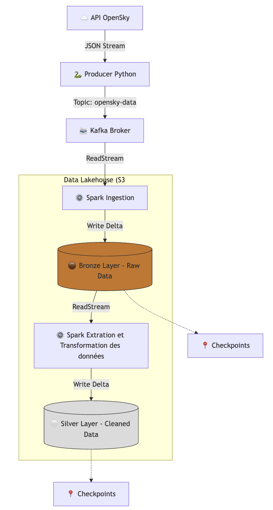

# Schéma du flux de données - Pipeline OpenSky

## Description des étapes

### 1. Ingestion (Source) 📡

- **Source** : OpenSky Network API.
- **Composant** : Producer exécuté en background thread.
- **Fréquence** : Appel toutes les 15 secondes (respect du rate limiting).
- **Format** : Conversion des vecteurs d'état (listes) en objets JSON structurés avant l'envoi.

### 2. Messaging (Buffer) 📨

- **Système** : Apache Kafka.
- **Topic** : opensky-data.
- **Rôle** : Tampon de découplage pour garantir la résilience et absorber les pics de charge avant le traitement Spark.

### 3. Bronze Layer (Données Brutes) 🟤

- **Traitement** : Apache Spark Streaming (readStream).
- **Action** : Lecture depuis Kafka, parsing du schéma JSON, et écriture "as-is" (telle quelle).
- **Stockage** : S3 (Garage) au format Delta Lake.
- **Objectif** : Historisation complète et immuable de la donnée brute.
- **Technique** : Utilisation de Checkpoints pour garantir la tolérance aux pannes (Exactly-once delivery).

### 4. Silver Layer (Données Raffinées) ⚪

- **Traitement** : Apache Spark Streaming.
- **Action** : Lecture du flux Bronze et application des règles métier.
- **Transformations appliquées** :
    - **🧹 Filtrage** : Suppression des vols sans identifiant (icao24) ou sans coordonnées GPS.
    - **🕒 Typage** : Conversion du timestamp Unix en format Timestamp standard.
    - **🏎️ Enrichissement** : Calcul de la vitesse en km/h (velocity * 3.6).
    - **📋 Projection** : Sélection et renommage des colonnes utiles pour l'analyse.
- **Stockage** : Table Delta optimisée pour les requêtes analytiques.

## Comment utiliser le notebook 01_streaming_bronze_and_silver ?

### 1️⃣ Étape 1 : Configuration et Initialisation (Cellules 0, 1, 2, 3)

**Objectif** : Charger la configuration, initialiser Spark, vérifier le bucket S3 et lancer le Producer Python.

1. **Exécute la Cellule 0** (Variables globales)
   - Importe les librairies nécessaires (threading, kafka, requests, etc.)
   - Définit les variables de configuration (Kafka, Garage/S3, credentials)
   - 👀 Tu dois voir : `✅ Configuration chargée.`

2. **Exécute la Cellule 1** (Initialisation de Spark)
   - Configure la SparkSession avec les packages nécessaires (Delta Lake, Kafka, S3)
   - Configure la connexion S3 vers Garage (MinIO)
   - 👀 Tu dois voir : `✅ Spark Session configurée (Région 'garage' forcée).`

3. **Exécute la Cellule 2** (Vérification du bucket)
   - Vérifie l'existence du bucket `datalake` sur Garage
   - Le crée s'il n'existe pas
   - 👀 Tu dois voir : `✅ Le bucket 'datalake' existe déjà.` (ou message de création)

4. **Exécute la Cellule 3** (Thread Producer)
   - Lance un thread en arrière-plan qui interroge l'API OpenSky toutes les 15 secondes
   - Publie les données sur le topic Kafka `opensky-data`
   - 👀 Tu dois voir : `✅ Le Producer tourne en arrière-plan ! Passez à la suite.`
   - 👀 Puis régulièrement : `📡 [THREAD PRODUCER] XX vols envoyés à HH:MM:SS`

⚠️ **Important** : Laisse cette cellule tourner. Ne l'arrête pas. Le Producer tourne en arrière-plan et alimente Kafka.

> 💡 **Note** : La Cellule 4 est optionnelle. Elle permet d'arrêter le Producer si besoin (en définissant `stop_producer = True`).

### 2️⃣ Étape 2 : Remplir le Bronze (Cellule 5)

**Objectif** : Créer la couche Bronze en lisant depuis Kafka et en écrivant les données brutes sur S3.

1. **Exécute la Cellule 5** (Streaming vers Bronze)
   - Définit le schéma des données OpenSky
   - Lit le stream depuis Kafka (topic `opensky-data`)
   - Parse les messages JSON selon le schéma
   - Écrit en Delta Lake sur S3 : `s3a://datalake/bronze/flights`
   - Utilise un checkpoint pour la tolérance aux pannes

2. **⏳ Patiente 2 à 3 minutes**
   - Le stream Spark traite les données en micro-batches
   - Les logs peuvent être limités en mode cluster, c'est normal

3. **Vérification Visuelle** :
   - Ouvre ton navigateur sur **Garage WebUI** (généralement `http://localhost:3909` ou le port configuré)
   - Navigue vers `datalake > bronze > flights`
   - Tu DOIS voir :
     - Le dossier `_delta_log` (métadonnées Delta Lake)
     - Des fichiers `.parquet` (données)

4. **🛑 Une fois que tu as vu les fichiers : ARRÊTE LA CELLULE 5** (Bouton Carré Noir ⏹️)
   - Pourquoi ? Pour libérer les ressources avant de lancer le Silver
   - Le Producer continue de tourner en arrière-plan et alimente Kafka

### 3️⃣ Étape 3 : Créer le Silver (Cellule 6)

**Objectif** : Lire les données Bronze, les nettoyer et les enrichir pour créer la couche Silver.

1. **Exécute la Cellule 6** (Streaming vers Silver)
   - Lit en streaming depuis la table Bronze (Delta Lake)
   - Applique les transformations :
     - Filtre les enregistrements sans `icao24` ou sans coordonnées GPS
     - Convertit le timestamp Unix en format datetime (`event_timestamp`)
     - Calcule la vitesse en km/h (`velocity_kmh = velocity * 3.6`)
     - Sélectionne et renomme les colonnes pertinentes
   - Écrit en Delta Lake sur S3 : `s3a://datalake/silver/flights`

2. **⏳ Patiente 1 à 2 minutes**
   - Spark lit tout ce que le Bronze a stocké à l'étape précédente
   - Les transformations sont appliquées en streaming

3. **Vérification Visuelle** :
   - Retourne sur le **Garage WebUI**
   - Navigue vers `datalake > silver > flights`
   - Tu devrais voir :
     - Le dossier `_delta_log`
     - Des fichiers `.parquet` avec les données nettoyées et enrichies

4. **🛑 Une fois que tu as vu les fichiers : ARRÊTE LA CELLULE 6** (Bouton Carré Noir ⏹️)

### 4️⃣ Étape 4 : Vérification (Cellule 7)

**Objectif** : Vérifier que les données Silver sont bien présentes et correctement formatées.

1. **Exécute la Cellule 7** (Afficher les données Silver)
   - Lit la table Silver depuis S3
   - Affiche les 5 premières lignes avec `.show(5)`

2. **👀 Tu dois voir** :
   - Un tableau avec les colonnes : `event_timestamp`, `icao24`, `callsign`, `origin_country`, `longitude`, `latitude`, `velocity_kmh`, `altitude_meters`, `on_ground`, `category`
   - Les données doivent être propres (pas de nulls pour `icao24`, `latitude`, `longitude`)
   - La vitesse doit être en km/h
   - Le timestamp doit être au format datetime

### 🔄 Pour relancer le pipeline complet

Si tu veux relancer tout le pipeline :

1. **Arrête le Producer** (optionnel) : Exécute la Cellule 4 pour arrêter le thread Producer
2. **Relance le Producer** : Exécute la Cellule 3
3. **Relance le Bronze** : Exécute la Cellule 5 (laisse tourner quelques minutes puis arrête)
4. **Relance le Silver** : Exécute la Cellule 6 (laisse tourner puis arrête)
5. **Vérifie** : Exécute la Cellule 7

### ⚠️ Points d'attention

- **Checkpoints** : Les checkpoints sont stockés dans `s3a://datalake/checkpoints/`. Si tu veux repartir de zéro, supprime ces dossiers.
- **Mode "latest" vs "earliest"** : La Cellule 5 utilise `startingOffsets: "latest"` pour ne lire que les nouveaux messages. Si tu veux traiter tout l'historique Kafka, change en `"earliest"`.
- **Ressources** : Les streams Spark consomment de la mémoire. Arrête les cellules de streaming avant de lancer la suivante si tu es limité en ressources.
- Ne surtout pas oublier d'arrêter le Producer pour éviter de cramer les 400 requêtes par jour.

